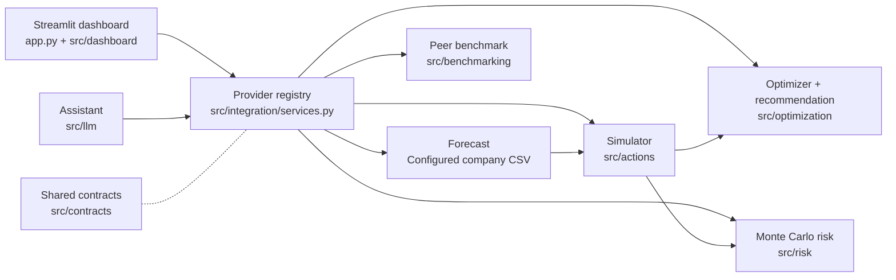

<div align="center">

# 🌱 CarbonOpt AI

### Decide how to cut emissions without breaking the budget.

A decision-support dashboard that forecasts a company's emissions and profit, simulates six decarbonisation actions, and searches for the best trade-offs under real budget, profit and CO₂ constraints.

[](https://github.com/alimert05/ADAHACK_SimpleMen/actions/workflows/ci.yml)


-2E7D32)


**Built by Team SimpleMen for ADAHACK.**

[Quick start](#-quick-start) · [How it works](#-how-it-works) · [Configuration](#-configuration) · [Chatbot](#-assistant-chatbot) · [Project layout](#-project-layout) · [Docs](#-documentation)

</div>

---

## ✨ What it does

| | Capability | Detail |
|---|---|---|
| 📈 | **Baseline forecast** | 12-month business-as-usual emissions and profit, with a temporal backtest. |
| 🎛️ | **What-if simulator** | Dial six actions between 0% and 100% and see CO₂, profit, spend and net cash change instantly. |
| 🧬 | **Constrained optimisation** | NSGA-II searches for the emissions/profit Pareto frontier under your budget, profit floor and CO₂ target. |
| 🎯 | **Recommendation** | Picks one strategy from the frontier with a deterministic policy, or says plainly when nothing is feasible. |
| 🎲 | **Monte Carlo risk** | Probability that a strategy still meets the budget and CO₂ target when assumptions are uncertain. |
| 🏁 | **Peer benchmark** | Compares the forecast against an offline snapshot of peer companies. |
| 💬 | **Assistant** | A floating chatbot that explains results and runs the same tools as the UI. |
| 🔍 | **Transparent assumptions** | Synthetic data and illustrative action assumptions are labelled; full provenance is included in the analysis download. |

### The six actions

`renewable_energy` · `ev_adoption` · `building_efficiency` · `travel_reduction` · `cloud_efficiency` · `supplier_transition`

Each is a fraction in [0, 1]. The simulator is deterministic and accounts for capex, incremental opex, savings and the interactions between actions.

> ⚠️ **All company data is synthetic**, and the action assumptions are illustrative and uncalibrated. The dashboard labels this wherever it matters. Treat results as a demonstration of the method, not as advice.

---

## 🚀 Quick start

You need [Git](https://git-scm.com/downloads) and [Miniconda](https://docs.conda.io/en/latest/miniconda.html) (or Anaconda).

```bash
git clone https://github.com/alimert05/ADAHACK_SimpleMen.git
cd ADAHACK_SimpleMen

conda env create -f environment.yml      # creates the "adahack" env (Python 3.11)
conda activate adahack
python -m pip install -r requirements.txt   # pins streamlit, pymoo, pytest to the tested versions

python -m streamlit run app.py
```

Open <http://localhost:8501>. Add `--server.port 8599` to change the port, or `--server.headless true` to skip opening a browser.

**Try it:** the sidebar uses the configured company defaults (£20,000,000 implementation budget, £30,000,000 cumulative operating profit floor and a 10% CO₂ reduction target). Click **Optimize** to compare feasible plans. Set the budget to £0 to explore the no-recommendation state. The first forecast trains the configured models; later runs reuse saved results.

Run `conda activate adahack` in every new terminal.

### Verify the install

```bash
python -m pytest                              # contract, unit and integration tests, offline by default
python -m pytest tests/contracts tests/unit   # the fast subset CI runs first
```

One test is skipped by default: the live Ollama smoke test (see [Chatbot](#-assistant-chatbot)).

---

## 🔌 Configuration

Launch with `python -m streamlit run app.py`. The dashboard uses one integrated path:
the CSV-backed forecasting service, action simulator, NSGA-II optimizer, risk analysis
and peer benchmarking. There is no provider selector or mode environment setting.
Required service failures stop analysis with a user-facing message; details go to server logs.

`config/integration.json` binds the company CSV, import mapping, data provenance,
forecast settings, action assumptions, uncertainty settings, peer benchmark and planning
defaults. Set `CARBONOPT_CONFIG` to another configuration file when deploying a different
company. The company ID comes from that file's import mapping.

Explicit mock and hybrid service construction remains available only as a test injection
seam. Test doubles and fixture/domain combinations are covered by the regression suite;
they are not dashboard launch options.

The Model Selection panel compares methods on the historical dataset independently.
It does not alter the configured planning forecast or its model identity.

---

## 🧭 How it works



1. **Baseline.** A 12-month emissions and profit forecast for the company.
2. **Simulate.** The action engine applies a six-action configuration to the baseline and reports CO₂, operating profit, gross outlay and net cash.
3. **Optimise.** NSGA-II explores action mixes that minimise emissions and maximise profit, drops candidates that break your constraints, and keeps the Pareto-optimal set.
4. **Recommend.** A deterministic equal-weight policy picks one strategy. Risk results can inform the choice when enabled.
5. **Stress-test.** Monte Carlo trials perturb the action assumptions and estimate the chance the strategy still meets its targets.

All providers talk through typed, validated contracts in `src/contracts/`, which is why a mock can be swapped for the real implementation without touching the UI.

---

## 🖥️ The dashboard

| Section | What you see |
|---|---|
| Company context and baseline | KPIs and the 12-month baseline |
| Forecast evaluation | Temporal backtest of the forecast |
| Optimized strategies | Interactive Pareto frontier, click a point to select it |
| Selected strategy | KPIs, constraint checks and feasibility badges |
| Manual what-if | Sliders for each action, using the same simulator |
| Monthly baseline vs scenarios | Month-by-month emissions and profit |
| Decision confidence | Uncertainty probabilities, peer comparison, risk preferences and existing forecast explanations when available |
| Assumptions and export | Expandable action assumptions and costs, plus a full analysis download |
| Real data and sources | Public reference, official-factor scenario and source links (below) |

### Real data and sources (what is real, what is not)

The **Real data and sources** expander is self-contained and never feeds the optimizer:

| Item | Label | Source, date |
|---|---|---|
| Wincanton FY2024 energy, emissions, revenue (annual totals) | Reported historical, 2023-04-01 to 2024-03-31 | [Wincanton Annual Review 2024](https://win-12731-s3.s3.eu-west-2.amazonaws.com/assets/7317/2796/5575/Wincanton_Annual_Review_2024.pdf), printed pp. 1, 5, 24–25; snapshot `data/public/wincanton_fy2024.json`, retrieved 2026-10-03 |
| UK electricity factor 0.13096 kgCO2e/kWh | Official factor (ID `7_400_4000_5_1`, row 3066, v1.2) | [GOV.UK conversion factors 2026](https://www.gov.uk/government/publications/greenhouse-gas-reporting-conversion-factors-2026), July-revised flat workbook; `data/public/uk_factors_2026.json` |
| Electricity-reduction calculator | Scenario: 2026 factor × FY2024 activity; reduction and £0.25/kWh tariff are assumptions | Default 10% → **1,014.74 tCO2e**, gross energy-cost saving before capex/opex |
| GB grid forecast, one-hour 100 kWh task | Forecast gCO2/kWh (GB average), kgCO2; scheduling illustration only, never added to corporate totals | [Carbon Intensity API](https://carbon-intensity.github.io/api-definitions/) `fw48h` (NESO, CC BY 4.0). Startup shows the **Recorded example** `data/public/grid_forecast_snapshot.json` (fetched 2026-10-03 16:02 UTC) as a historical replay; **Refresh grid forecast** makes one 5 s request (cached 30 min) and only then offers upcoming windows. A failed refresh shows an error and keeps the recorded example |
| Cloud | Planned | [Cloud Carbon Footprint](https://github.com/cloud-carbon-footprint/cloud-carbon-footprint) is the future method; current cloud figures are illustrative |

Wincanton is a public reference, not a customer. The six-action optimizer still analyses the configured company on synthetic, uncalibrated history and illustrative action economics; nothing in the panel changes its inputs. No network access is needed at startup.

One-minute demo: open **Real data and sources** → show the report link and 77,485 MWh non-transport electricity → move the reduction slider (10% ≈ 1,014.74 tCO2e) → press **Refresh grid forecast** and say whether the chart is live or recorded → scroll to the optimizer and describe its inputs as illustrative.

---

## 💬 Assistant (chatbot)

A floating button at the bottom-left opens the assistant. By default it is a **guided assistant** that recognises preset questions and runs dashboard tools offline. The real model is a **remote Ollama server** running `llama3.1:8b`. This repository only contains the client: it downloads no weights and installs no server.

The model interprets language and explains results. It calls an allow-listed set of tools, and the app validates every call before running it through the same providers as the UI.

The app does not auto-load `.env`, so export variables in your shell (copy [`.env.example`](.env.example) as a starting point):

```bash
# guided assistant (default)
python -m streamlit run app.py

# remote model, once you have an endpoint
CHATBOT_PROVIDER=ollama OLLAMA_BASE_URL=https://<your-ollama-host> \
python -m streamlit run app.py
```

| Variable | Meaning | Default |
|---|---|---|
| `CHATBOT_PROVIDER` | `mock` or `ollama` | `mock` |
| `OLLAMA_BASE_URL` | Remote endpoint, required for `ollama` | none |
| `OLLAMA_MODEL` | Model tag | `llama3.1:8b` |
| `OLLAMA_TIMEOUT_SECONDS` / `OLLAMA_MAX_OUTPUT_TOKENS` | Limits | `60` / `512` |
| `OLLAMA_API_KEY` | Optional gateway bearer token | none |

Remote failures appear as a retryable user-facing error; server logs retain diagnostics. Connection-check APIs remain available for integration tests. To run the opt-in live test:

```bash
RUN_OLLAMA_LIVE_SMOKE=1 CHATBOT_PROVIDER=ollama OLLAMA_BASE_URL=https://<host> \
python -m pytest tests/integration/test_ollama_live.py
```

Details: [docs/CHATBOT_IMPLEMENTATION.md](docs/CHATBOT_IMPLEMENTATION.md).

---

## 🛠️ Command-line tools

No UI needed. These use the fixture baseline in `tests/fixtures/v1/` and print their provenance.

```bash
# WS2 backend: simulate one configuration, run the optimizer, or time the simulator
python -m src.optimization.cli simulate
python -m src.optimization.cli optimize --max-evaluations 256 --output optimization.json
python -m src.optimization.cli profile

# WS3 Monte Carlo risk demo (100 trials against the mock simulator)
python scripts/demo_ws3_risk.py
```

Add `--help` to any subcommand for its flags.

### Forecasting and data generation

The generator creates source data. The modelling pipeline is also used by the forecasting adapter; the commands below can run independently.

```bash
python synthetic_data_generation/synthetic_data_generator.py   # ~4 s, plots to synthetic_data_generation/temp_outputs/
python ml_core/modelling.py                                    # ~40 s, forecast to ml_core/temp_outputs/modelling_results/
```

The generator simulates 25 years of monthly logistics-company data. The modelling script compares a seasonal-naive baseline, Random Forest and (if installed) XGBoost, LightGBM and Prophet with walk-forward backtests, then forecasts the next three months of emissions and profit with prediction intervals. The `temp_outputs/` folders are git-ignored.

---

## 🧩 Project layout

```text
app.py                      Streamlit entry point
src/
├── contracts/              Typed schemas, validation, errors, provider protocols
├── integration/            Company service registry and analysis pipeline
├── actions/                WS2  six-action simulator and financial accounting
├── optimization/           WS2  NSGA-II, Pareto, constraints, recommendation, CLI
├── risk/                   WS3  Monte Carlo risk
├── benchmarking/           WS3  offline peer benchmark
├── dashboard/              WS4  panels, charts, state, chat UI
└── llm/                    WS4  chatbot client, tools, mock model
ml_core/                    WS1  multi-target forecasting pipeline and model comparison
synthetic_data_generation/  WS1  synthetic company data generator
config/                     Action assumptions, uncertainty and benchmark settings
data/                       Offline peer benchmark snapshot
tests/                      Contract, unit and integration tests, plus mocks and fixtures
carbonopt-ai-docs/          Specifications and handoffs
docs/                       Workstream handoffs and chatbot notes
```

### Integrated modules

CSV import and forecasting feed simulation, optimization, recommendation, risk and
benchmarking through validated contracts. Existing SHAP and assistant infrastructure
is preserved. Further SHAP work and Llama textual explanations are separate tasks.

The source company data remains synthetic and action economics remain illustrative;
using domain services does not make the data reported or the assumptions calibrated.

---

## 📚 Documentation

| Document | Purpose |
|---|---|
| [carbonopt-ai-docs/](carbonopt-ai-docs/README.md) | Full specification set: contracts, schemas, action model, forecasting, risk and benchmark |
| [Implementation plan](carbonopt-ai-docs/IMPLEMENTATION_PLAN.md) | Scope, priorities, ownership, milestones |
| [Integration guide](carbonopt-ai-docs/docs/INTEGRATION_GUIDE.md) | Provider wiring and checkpoints |
| [WS2 handoff](docs/handoffs/WS2_HANDOFF.md) | Action engine and optimiser details |
| [WS4 handoff](docs/handoffs/WS4_DASHBOARD_HANDOFF.md) | Dashboard and provider registry |
| [WS3 delivery](carbonopt-ai-docs/docs/handoffs/ws3/WS3_DELIVERY.md) | Risk and benchmark delivery notes |
| [Chatbot plan](docs/CHATBOT_IMPLEMENTATION.md) | Assistant architecture |

---

## 🧰 Environment management

| Task | Command |
|---|---|
| Update after `environment.yml` changes | `conda env update -f environment.yml` |
| Reinstall pinned app and test dependencies | `python -m pip install -r requirements.txt` |
| Register a Jupyter kernel | `python -m ipykernel install --user --name adahack --display-name "Python (adahack)"` |
| Deactivate | `conda deactivate` |
| Remove the environment | `conda env remove -n adahack` |

To add a dependency, put it under `dependencies:` in `environment.yml` (or under `- pip:` if it is pip-only). If the app or tests need it, also pin it in `requirements.txt`, which CI installs. Then update the env and commit both files.

## 🩺 Troubleshooting

| Symptom | Fix |
|---|---|
| Company analysis could not be loaded | Check server logs, installed requirements and `CARBONOPT_CONFIG` company files. |
| Forecast logs mention OpenMP on macOS | Install the runtime with `brew install libomp`, or use the configured conda environment. |
| `ModuleNotFoundError` for streamlit, pymoo or pytest | Activate `adahack`, then run `python -m pip install -r requirements.txt`. |
| `ModuleNotFoundError: src` | Run commands from the repository root. |
| Chat shows an error with `ollama` | `OLLAMA_BASE_URL` is unset or unreachable. Use `CHATBOT_PROVIDER=mock` to work offline. |
| Port 8501 is busy | Add `--server.port 8599`. |
