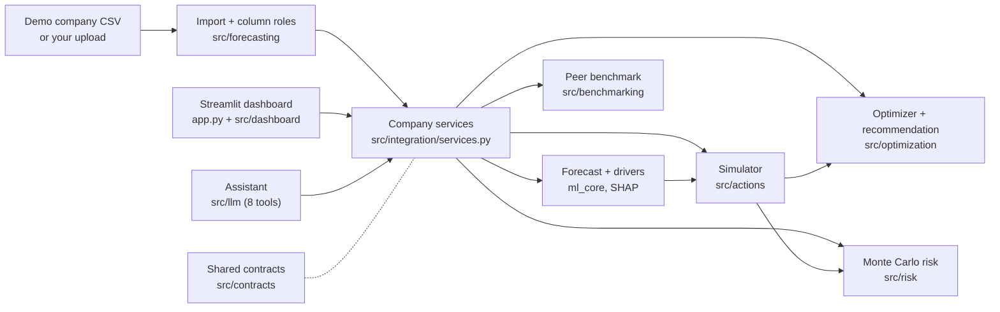

<div align="center">

# 🌱 CarbonOpt AI

### Decide how to cut emissions without breaking the budget.

A decision-support dashboard that forecasts a company's emissions and profit, simulates six decarbonisation actions, and searches for the best trade-offs under real budget, profit and CO₂ constraints.

[](https://github.com/alimert05/ADAHACK_SimpleMen/actions/workflows/ci.yml)


-2E7D32)


**Built by Team SimpleMen for ADAHACK.**

[Quick start](#-quick-start) · [How it works](#-how-it-works) · [Configuration](#-configuration) · [Chatbot](#-assistant-chatbot) · [Project layout](#-project-layout) · [Docs](#-documentation)

</div>

---

## ✨ What it does

| | Capability | Detail |
|---|---|---|
| 📂 | **Your own data** | Upload any monthly CSV; columns are matched to what the analysis needs, whatever they are called. |
| 📈 | **Baseline forecast** | 12-month business-as-usual emissions and profit, checked against a simple seasonal repeat. |
| 🧪 | **Model comparison** | On request, score XGBoost, LightGBM, Random forest, Prophet and a seasonal repeat on your data, and forecast with the one you pick. |
| 🎛️ | **What-if simulator** | Dial the actions your data supports between 0% and 100% and see CO₂, profit, spend and net cash change instantly. |
| 🧬 | **Constrained optimisation** | NSGA-II searches for the emissions/profit Pareto frontier under your budget, profit floor and CO₂ target. |
| 🎯 | **Recommendation** | Picks one strategy from the frontier with a deterministic policy; when nothing is feasible, says which single change to a goal would work. |
| 🎲 | **Monte Carlo risk** | Probability that a strategy still meets each goal when action effects and costs vary, with the method explained on the page. |
| 🔎 | **Forecast drivers** | SHAP shows which inputs move the forecast; keep the top *k*. |
| ⏱️ | **Grid timing** | The cleanest hour on the GB grid for moving flexible electricity use. |
| 🏁 | **Peer benchmark** | Compares the forecast against an offline snapshot of peer companies. |
| 💬 | **Assistant** | A floating chatbot (guided, or a local model such as Gemma 4) that answers with the same tools as the page. |
| 🔍 | **Transparent assumptions** | Synthetic data and illustrative action assumptions are labelled; full provenance is included in the analysis download. |

### The six actions

`renewable_energy` · `ev_adoption` · `building_efficiency` · `travel_reduction` · `cloud_efficiency` · `supplier_transition`

Each is a fraction in [0, 1]. The simulator is deterministic and accounts for capex, incremental opex, savings and the interactions between actions. An action whose activity your data does not report (say, a fleet) is switched off and explained, not guessed.

> ⚠️ **The demo company's data is synthetic**, and action costs are illustrative and uncalibrated (for uploads they are scaled to your own activity). The dashboard labels this wherever it matters. Treat results as a demonstration of the method, not as advice.

---

## 🚀 Quick start

You need [Git](https://git-scm.com/downloads) and [Miniconda](https://docs.conda.io/en/latest/miniconda.html) (or Anaconda).

```bash
git clone https://github.com/alimert05/ADAHACK_SimpleMen.git
cd ADAHACK_SimpleMen

conda env create -f environment.yml      # creates the "adahack" env (Python 3.11)
conda activate adahack
python -m pip install -r requirements.txt   # pins every app and test dependency to the tested versions

python -m streamlit run app.py
```

Open <http://localhost:8501>. Add `--server.port 8599` to change the port, or `--server.headless true` to skip opening a browser.

**Try it:** the sidebar starts with the demo company's goals (£20m budget, £30m profit floor, 10% CO₂ cut). Press **Find plans** to compare plans, or set the budget to £0 to see the no-plan hints. The first load fits a forecast in about 10 seconds; later loads reuse it. Switch **Company data** to **Your data** to upload your own file (see [Using your own data](#using-your-own-data)).

Run `conda activate adahack` in every new terminal.

### Verify the install

```bash
python -m pytest                              # contract, unit and integration tests, offline by default
python -m pytest tests/contracts tests/unit   # the fast subset CI runs first
```

One test is skipped by default: the live Ollama smoke test (see [Chatbot](#-assistant-chatbot)).

---

## 🔌 Configuration

Launch with `python -m streamlit run app.py`. The dashboard uses one integrated path:
the CSV-backed forecasting service, action simulator, NSGA-II optimizer, risk analysis
and peer benchmarking. There is no provider selector or mode environment setting.
Required service failures stop analysis with a user-facing message; details go to server logs.

`config/integration.json` binds the company CSV, import mapping, data provenance,
forecast settings, action assumptions, uncertainty settings, peer benchmark and planning
defaults. Set `CARBONOPT_CONFIG` to another configuration file when deploying a different
company. The company ID comes from that file's import mapping.

Tests inject doubles per slot through `tests.mocks.make_services`; they are not launch
options. See [Architecture](docs/ARCHITECTURE.md) for how services and the pipeline fit together.

The forecast is a RandomForest (seasonal-naive below 5 years of history) scored against a
seasonal repeat over the last 12 months. Other models (XGBoost, LightGBM, Prophet) are only run
when you ask: **Compare forecasting models** in section 1 scores the models you pick on the loaded
data, and **Forecast with** rebuilds the forecast, plans and drivers with the one you choose.

---

## 🧭 How it works



1. **Import.** The demo CSV or your upload is mapped to one canonical monthly history; every change is recorded.
2. **Baseline.** A 12-month emissions and profit forecast (Random forest by default, or the model you choose).
3. **Simulate.** The action engine applies a six-action configuration to the baseline and reports CO₂, operating profit, gross outlay and net cash.
4. **Optimise.** NSGA-II explores action mixes that minimise emissions and maximise profit, drops candidates that break your goals, and keeps the Pareto-optimal set. When none fits, the mixes it tried show which goal to loosen.
5. **Recommend.** A deterministic equal-weight policy picks one strategy. Risk results can inform the choice when enabled.
6. **Stress-test.** Monte Carlo trials vary each action's effect and costs and count how often the strategy still meets its goals.

All providers talk through typed, validated contracts in `src/contracts/`, so the page, the assistant and the tests use the same services.

---

## 🖥️ The dashboard

One page, read top to bottom like a short report:

| Section | What you see |
|---|---|
| 1 · Starting point | Next-12-month emissions, revenue and profit, forecast accuracy, history running into the forecast (drag **History shown** to change the period), and an on-demand model comparison |
| 2 · Plans | The trade-off chart (click a plan), the recommended plan, its figures and action mix, and where its cut comes from by scope. When no plan meets the goals: which single change would (budget, profit floor or CO₂ target), read from the mixes tried |
| 3 · Your mix | Sliders for the actions your data supports, with the same figures and a goal check |
| 4 · Confidence | Uncertainty (with how the Monte Carlo trials are drawn), risk appetite, peer comparison and forecast drivers (keep the top *k* inputs), when turned on |
| 5 · Timing | The cleanest hour on the GB grid for flexible electricity use (saved example offline, live forecast on request) |
| 6 · Assumptions | The costs, prices and factors behind every number, and a full JSON download |

The sidebar shows what each goal accepts: the budget is £0 or more and stops mattering above the cost
of every action at full take-up; the profit floor can be any amount (the no-action forecast is shown).

### Using your own data

Any monthly table works: column names, units, currency and which figures you report can all differ. Instead
of a fixed layout, the app asks which of *your* columns plays each role.

1. **Choose Your data** under **Company data** in the sidebar. The page explains the steps and offers
   **Download an example file** (`data/sample_upload.csv`: 8 years of a USD manufacturer with no fleet).
2. **Upload a CSV** (comma, semicolon or tab separated): one row per month, at least 24 months, dates in any
   common format (`2024-01`, `Jan 2024`, `01/01/2024`).
3. **Check the matches.** Each role gets a dropdown pre-filled from your column names (for example "Net Sales
   (USD)" → Revenue, "Scope 2 market-based" → Scope 2, "Renewable %" → Renewable share); pick "not in my data"
   for anything you don't have. Set the company name, the month column, the currency and its rate to pounds.
   What is still missing, or what cannot be used and why, is shown as you go.
4. **Read the summary** ("Ready: 96 months from Jan 2018 to Dec 2025") and the list of what the import did,
   then press **Analyse this data**. The forecast is fitted to your history in a few seconds.
5. **Change file or columns** in the sidebar takes you back to the upload step at any time.

| Role | Needed? | What it unlocks |
|---|---|---|
| Month | required | |
| Revenue | required | budget and profit-floor starting points |
| Operating profit, or operating cost (profit = revenue − cost) | required | the profit side of every plan |
| Emissions: a total and/or Scope 1, 2, 3 (tCO₂e) | at least one | everything; missing scopes are worked out from the total |
| Electricity (kWh), renewable share | optional | renewable electricity, building efficiency |
| Gas (kWh) | optional | building efficiency (heating) |
| Fleet distance (km), EV share, fleet size | optional | EV fleet adoption |
| Business travel (km) | optional | travel reduction |
| Cloud compute (hours) | optional | cloud efficiency |
| Employees | optional | context only |

What the import does, each step listed under **What the import does to your data**:

- money in EUR or USD is converted to GBP at the fixed rate you set (defaults 0.85 and 0.79, illustrative);
- percentages above 1 (such as 35) are read as shares (0.35);
- missing months and empty cells are filled by interpolation from the months either side;
- with a total, an unreported scope is the total minus the reported ones; with only scopes, the total is their sum;
- missing electricity is estimated from Scope 2 at 0.207 kgCO₂e/kWh;
- profit is revenue minus operating cost when only a cost column is given.

It refuses, with a message saying how to fix it: fewer than 24 months, the same month twice, unreadable dates,
mapped columns with no numbers, a total smaller than the reported scopes, and 100% renewable supply in months
with Scope 2 emissions.

After the upload, the whole page runs on your company: your own forecast, action costs scaled to your activity
(`src/actions/calibrate.py`, still illustrative), goals sized to you (a budget of about 8% of yearly revenue, a
profit floor of about 80% of yearly profit, a 10% cut), only the actions your data supports get a slider (the
rest are listed with what they need), and the grid-timing section starts from your average hourly electricity.
Peer comparison usually reports "no comparable peers" for uploads.

The same path works without the page:

```python
import hashlib
from pathlib import Path

import pandas as pd

from src.forecasting.mapping import detect_currency, detect_date_column, import_mapping, suggest_mapping
from src.integration.services import create_dataset_services

path = Path("data/sample_upload.csv")
raw = pd.read_csv(path)
date = detect_date_column(raw)
mapping = import_mapping(suggest_mapping(list(raw.columns), date), company="Acme Manufacturing",
                         date_column=date, currency=detect_currency(list(raw.columns)), gbp_per_unit=0.79)
services = create_dataset_services(raw, mapping, name=path.name, sha256=hashlib.sha256(path.read_bytes()).hexdigest())
baseline = services.forecast.get_baseline(company_id=services.forecast.company_id, horizon_months=12)
# then src.integration.run_analysis(request, services=services) as the page does
```

`create_dataset_services(..., model="SeasonalNaive")` (or `create_services(model=...)` for the demo) forecasts
with a specific model. The mapping is the same shape as `config/company_import.json`.

---

## 💬 Assistant (chatbot)

A round button at the bottom-right opens the assistant. Ask in your own words; it answers from your current
analysis and shows the facts it used as cards under each answer. By default it is a **guided assistant** that
recognises preset questions and runs offline. For a real language model, run one locally in **LM Studio**
(tested with `google/gemma-4-12b`) or point it at an **Ollama** server. This repository only contains the
client: it downloads no weights and installs no server.

```bash
# guided assistant (default)
python -m streamlit run app.py

# Gemma 4 in LM Studio: start its server and load the model first
lms server start && lms load google/gemma-4-12b
CHATBOT_PROVIDER=lmstudio python -m streamlit run app.py

# a model on an Ollama server
CHATBOT_PROVIDER=ollama OLLAMA_BASE_URL=https://<your-ollama-host> python -m streamlit run app.py
```

**How a question is answered.** The model gets a compact summary of the dashboard (company, data kind,
forecast totals, goals, selected plan), never the data files. It chooses from eight allow-listed tools; the app
validates every argument and runs the tool through the same services as the page, so every number is computed,
not guessed. At most three tool runs per question; repeated identical calls are not re-run. What-ifs and plan
searches are previews until you press **Apply to dashboard** or **Load recommended into what-if**.

| Tool | Arguments | Answers questions like |
|---|---|---|
| `get_baseline` | none | "Show the forecast", "how accurate is it?", "which model?" (model name, monthly miss vs simply repeating last year, import notes) |
| `get_company_profile` | none | "Where do our emissions come from?", trends, what the data does not report |
| `get_forecast_drivers` | `top_k` (default 5) | "What drives the forecast?" (top inputs, plain names, share and direction) |
| `compare_actions` | none | "Which action cuts the most?", "cheapest per tonne?", which actions do nothing here |
| `simulate_strategy` | `actions` (fraction of what is left, 0–1), `final_shares` (final renewable/EV share, 0–1), `start_from` | "What if EV share becomes 80%?", "half of the remaining renewable", "explain the selected plan" |
| `optimize_strategies` | optional budget, profit floor, CO₂ target (0–1) | "Find a plan within £500k", "can we reach 40% with £1m?" (with what would make it work) |
| `get_risk_summary` | optional plan ID | "How likely are we to meet the target?" |
| `get_public_reference` | optional electricity cut (0–1) | Comparisons with Wincanton, a separate real company |

Answers from Gemma 4 take about 5–45 seconds on a laptop. The tool routing above was checked live on the demo
company and on the example upload; see [docs/CHATBOT_IMPLEMENTATION.md](docs/CHATBOT_IMPLEMENTATION.md) for
the questions, the rules the tools enforce, and the errors.

The app does not auto-load `.env`, so export variables in your shell (copy [`.env.example`](.env.example) as a starting point):

| Variable | Meaning | Default |
|---|---|---|
| `CHATBOT_PROVIDER` | `mock`, `lmstudio` or `ollama` | `mock` |
| `LMSTUDIO_BASE_URL` / `LMSTUDIO_MODEL` | LM Studio server and model | `http://localhost:1234/v1` / `google/gemma-4-12b` |
| `LMSTUDIO_TIMEOUT_SECONDS` / `LMSTUDIO_MAX_OUTPUT_TOKENS` / `LMSTUDIO_API_KEY` | Limits and optional token (Gemma 4 thinks before answering, so keep the budget generous) | `300` / `4096` / none |
| `OLLAMA_BASE_URL` | Remote endpoint, required for `ollama` | none |
| `OLLAMA_MODEL` | Model tag | `llama3.1:8b` |
| `OLLAMA_TIMEOUT_SECONDS` / `OLLAMA_MAX_OUTPUT_TOKENS` | Limits | `60` / `512` |
| `OLLAMA_API_KEY` | Optional gateway bearer token | none |

Model failures appear as an error with **Retry** (your question is kept; finished tools are not re-run), and
details go to the server log. To run the opt-in live Ollama test:

```bash
RUN_OLLAMA_LIVE_SMOKE=1 CHATBOT_PROVIDER=ollama OLLAMA_BASE_URL=https://<host> \
python -m pytest tests/integration/test_ollama_live.py
```

---

## 🛠️ Command-line tools

No UI needed. The optimizer CLI uses the fixture baseline in `tests/fixtures/v1/`; every command prints its provenance.

```bash
# WS2 backend: simulate one configuration, run the optimizer, or time the simulator
python -m src.optimization.cli simulate
python -m src.optimization.cli optimize --max-evaluations 256 --output optimization.json
python -m src.optimization.cli profile

# Train (or verify cached) forecast models before launching the dashboard
python -m src.forecasting.train

# Full analysis on the configured company, printed with timings
python -m scripts.run_integrated_analysis
```

Add `--help` to any subcommand for its flags.

### Forecasting and data generation

The generator creates source data. The modelling pipeline is also used by the forecasting adapter; the commands below can run independently.

```bash
python -m synthetic_data_generation.synthetic_data_generator   # ~4 s, plots to synthetic_data_generation/temp_outputs/
python -m ml_core.modelling                                    # ~40 s, forecast to ml_core/temp_outputs/modelling_results/
```

The generator simulates 25 years of monthly logistics-company data. The modelling script compares a seasonal-naive baseline, Random Forest and (if installed) XGBoost, LightGBM and Prophet with walk-forward backtests, then forecasts the next three months of emissions and profit with prediction intervals. The `temp_outputs/` folders are git-ignored.

---

## 🧩 Project layout

```text
app.py                      Streamlit entry point
src/
├── contracts/              Typed schemas, validation, errors, provider protocols
├── integration/            Company services, analysis pipeline and cache keys
├── forecasting/            WS1  data import, column matching for uploads, forecast and backtest
├── explainability/         WS1  forecast drivers (SHAP)
├── actions/                WS2  six-action simulator, accounting, cost scaling for uploads
├── optimization/           WS2  NSGA-II, Pareto, constraints, recommendation, CLI
├── risk/                   WS3  Monte Carlo risk
├── benchmarking/           WS3  offline peer benchmark
├── dashboard/              WS4  page sections, upload step, charts, state, chat UI
└── llm/                    WS4  chatbot client, tools, mock model
ml_core/                    WS1  multi-target forecasting pipeline and model comparison
synthetic_data_generation/  WS1  synthetic company data generator
config/                     Integration, action assumptions, uncertainty and benchmark settings
data/                       Demo company CSV, example upload, peer benchmark and public-data snapshots
scripts/                    End-to-end analysis runner
tests/                      Contract, unit and integration tests, plus mocks and fixtures
docs/                       Architecture, specifications and chatbot notes
```

The demo company's data is synthetic and action economics are illustrative, for the demo and (scaled) for
uploads; running real services on them does not make the data reported or the costs calibrated.

---

## 📚 Documentation

| Document | Purpose |
|---|---|
| [Shared contracts](docs/SHARED_CONTRACTS.md) · [Data schemas](docs/DATA_SCHEMAS.md) | Python boundaries, result types, errors; DataFrame/JSON fields and units |
| [Action model](docs/ACTION_MODEL.md) | The deterministic simulator, action interactions and accounting |
| [Forecasting](docs/FORECASTING_SPEC.md) · [Risk and benchmark](docs/RISK_AND_BENCHMARK_SPEC.md) | Model features and evaluation; Monte Carlo, recommendation policy, peers |
| [Architecture](docs/ARCHITECTURE.md) · [Tests and mocks](docs/TESTING_AND_MOCKS.md) | Services, pipeline and dashboard; fixtures and test doubles |
| [Decisions](docs/DECISIONS.md) | Frozen assumptions and recorded choices |
| [Chatbot](docs/CHATBOT_IMPLEMENTATION.md) | Assistant architecture |

---

## 🧰 Environment management

| Task | Command |
|---|---|
| Update after `environment.yml` changes | `conda env update -f environment.yml` |
| Reinstall pinned app and test dependencies | `python -m pip install -r requirements.txt` |
| Deactivate | `conda deactivate` |
| Remove the environment | `conda env remove -n adahack` |

To add a dependency, put it under `dependencies:` in `environment.yml` (or under `- pip:` if it is pip-only). If the app or tests need it, also pin it in `requirements.txt`, which CI installs. Then update the env and commit both files.

## 🩺 Troubleshooting

| Symptom | Fix |
|---|---|
| Company analysis could not be loaded | Check server logs, installed requirements and `CARBONOPT_CONFIG` company files. |
| Forecast logs mention OpenMP on macOS | Install the runtime with `brew install libomp`, or use the configured conda environment. |
| `ModuleNotFoundError` for streamlit, pymoo or pytest | Activate `adahack`, then run `python -m pip install -r requirements.txt`. |
| `ModuleNotFoundError: src` | Run commands from the repository root. |
| Chat shows an error with `ollama` | `OLLAMA_BASE_URL` is unset or unreachable. Use `CHATBOT_PROVIDER=mock` to work offline. |
| Chat shows an error with `lmstudio` | Start the server (`lms server start`), load the model (`lms load google/gemma-4-12b`) and check `lms ls` lists the same name as `LMSTUDIO_MODEL`. |
| Chat says it "ran out of room" | The model spent its token budget thinking. Ask one thing at a time or raise `LMSTUDIO_MAX_OUTPUT_TOKENS`. |
| Upload says "Still needed" | Pick a column for revenue, profit (or cost) and emissions (a total or a scope). |
| Upload says "The data cannot be used yet" | The message names the problem and the column, e.g. fewer than 24 months or a month listed twice. Fix the file or the chosen column. |
| A chosen forecasting model fails | Switch **Forecast with** back to Automatic. Tree models need about 5 years of months; Forecast drivers need a tree model. |
| Port 8501 is busy | Add `--server.port 8599`. |
